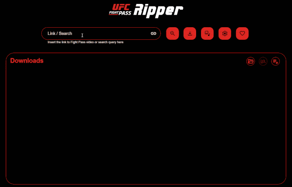

<h2 align="center">
    <br>
    
    <br>
    
    UFC Ripper: 📹 Video downloader tool for <a href="https://ufcfightpass.com">UFC Fight Pass</a> 🥊
    <br>
    
    <!--badges-->
    <a href="https://github.com/m4heshd/ufc-ripper/releases/latest">
        
    </a> <!--Downloads-->
    <a href="https://hub.docker.com/r/m4heshd/ufc-ripper">
        
    </a> <!--Docker-->
    <a href="https://github.com/m4heshd/ufc-ripper/blob/master/LICENSE">
        
    </a> <!--License-->
    <a href="https://www.paypal.me/m4heshdtt">
        
    </a> <!--PayPal-->
    <a href="https://ko-fi.com/m4heshd">
        
    </a> <!--Ko-fi-->
    <!---------->
</h2>

<p align="center">
    <br>
    
    <br>
</p>

### What is UFC Ripper?

An open-source video downloader tool for UFC Fight Pass that can run on both desktop and the cloud. The only thing it
can't do is STEAL videos free of charge for you. A paid Fight Pass subscription is required for this tool to work.

### Intellectual property (DISCLAIMER) ⚠️

The UFC logo and the UFC Fight Pass logo used in this project are intellectual properties of Zuffa LLC.

The user will be responsible for any content downloaded through this tool. Any kind of redistribution of that content is
illegal and this application or I (the developer) won't be liable for that.

### Dear Dana White,

This isn't a tool created for pirating your copyrighted content. This tool requires a **PAID FIGHT PASS SUBSCRIPTION**
to function. This merely eliminates the need to stream a massive amount of data through metered connections every time
you want to go back and watch your favorite fighters. I want your fighters to be paid more. Not less. This tool is not
in any way meant to rob you or them of any income coming in.

The whole reason for me to create this tool is for my own need. I live in a third-world country that was destroyed by
politicians. That made internet services more of a luxury than a right for the people of this country. Our internet
connections are very spotty and extremely limited. 1GB of data here costs more than a meal. Imagine that. I also
travel and the only thing that can keep me entertained is some UFC. But how do I watch UFC if I can hardly find 4G
coverage in my messed-up land? 🤷🏽

The thing about Fight Pass is, you can't control how much of your quota it's going to burn. Also, repeated viewings
waste a ton of data. But my love for MMA and UFC is unconditional. So I decided to whip up this tool to eliminate all of
these mentioned issues. Then I thought, "Why not share this with the world? There might be a ton of other people like me
around the world". So here we are. Hope you'd understand Dana. 🙂

# Support this project 🙏🏽

I get it, this isn't a well-done tool. The code looks messy, no tests, a lot of missing stuff, and a few bugs here and
there. But this COULD improve a lot. Working on this project requires a lot of time and energy.

You can help me by buying me a few coffees ☕ so I'm all buzzed up and got time to work on this further. Or you can send
a few monies my way to simply say thanks for the work that's already been done.

[](https://www.paypal.me/m4heshdtt?locale.x=en_US)

Or you can buy me a "ko-fi" by clicking this button

[](https://ko-fi.com/m4heshd)

# How to use?

## Installation

⚠️ UFC Ripper is currently only available for Windows and Linux systems, only in `x64`. It can also be run on the cloud
as a docker container.

### Desktop

No installation is required on the desktop. The app is portable.

1. Download the latest release corresponding to your system,
   - ### [Windows (x64)](https://github.com/m4heshd/ufc-ripper/releases/latest/download/ufc-ripper-win-x64.zip)
   - ### [Linux (x64)](https://github.com/m4heshd/ufc-ripper/releases/latest/download/ufc-ripper-linux-x64.zip)

2. Extract the content of the zip file to anywhere you like

3. Run the executable file (`ufc-ripper.exe` or `ufc-ripper`)

4. Open the browser and visit the URL shown in the console window.

5. The first run might ask you to download some third-party tools used by UFC Ripper. Click yes, and it will
   automatically download the latest versions from [media-tools](https://github.com/m4heshd/media-tools) repo.

### Docker

⚠️ Currently, the docker image is only built for `linux/amd64` systems which means it cannot be run on ARM-based systems
like older Raspberry Pis.

You can either build the docker image locally and run using [`docker-compose.yaml`](docker-compose.yaml) or use the
published [official image](https://hub.docker.com/r/m4heshd/ufc-ripper).

To build and run locally, simply run `npm run docker:up`.

Here's a docker-compose template for you lazies out there.

```yaml
version: "3"

services:
   ufc-ripper:
      image: m4heshd/ufc-ripper:latest # Using the latest version of the official image
      container_name: ufc-ripper
      restart: unless-stopped
      volumes:
         - ./config:/ufcr/config # Any configuration files will be stored here
         - ~/Downloads/ufc-ripper:/downloads # Downloaded videos will be stored here
      ports:
         - "8383:8383" # Web UI port
```

That's it.

## Usage

⚠️ You need to have a UFC Fight Pass account with a paid subscription, and to be logged into that account to use UFC
Ripper.

1. Open up the GUI in the browser and go into Configuration (⚙️ button) and log in with your UFC Fight Pass account
   using
   the "Fight Pass account" section.

2. Once successfully logged in, copy and paste a link to a UFC Fight Pass video in the "Link" input and hit the download
   button.

3. Optionally, look through the configuration to change any download settings (video quality, audio quality, etc..) to
   your needs

## Mention-worthy features

### Proxy support

This might come in handy when you run UFC Ripper as a docker container in the cloud because the service blocks any
requests initiated using a datacenter IP address.

If you set up a proxy, UFC Ripper will forward all API requests through that proxy server. Remember, only the API
requests will go through the proxy. Not the downloads. This also means that your proxy server will hardly have to
transfer any data through it.

### File numbering

UFC Ripper can automatically number each download incrementally. Let's say you discovered a fighter you haven't watched
before and interested in watching all of their fights in order. This feature would be very useful in an event like that.

## Development

You need to have Node.js (>=18) installed locally to develop, compile and package this project yourself.

1. Run `git clone https://github.com/m4heshd/ufc-ripper.git`

2. `cd` into the `ufc-ripper` directory and run `npm install`

That's it. Now you're ready to go.

**To run for development,**

1. Set `VITE_WS_URI=http://localhost:8383/` in `.env` file

2. Run `npm run start` to start the backend

3. Run `npm run dev` to start the front end with Vue HMR support

4. Open the browser and visit `http://localhost:8384/`

**To package the application for production,**

1. Run `npm run pack-win` or `npm run pack-linux` (packaging process is cross-platform compatible)

**To build and run the docker container,**

1. Run `npm run docker:up`

# Future improvements planned

- [x] Migrate to Vite (dev)
- [x] Support for concurrent multi-fragment download
- [ ] Ability to restart failed downloads
- [ ] Support for more architectures, including ARM-based systems
- [ ] Mobile-responsive Web UI
- [ ] Make completed files downloadable right from the UFC Ripper Web UI (hosted)
- [ ] Authentication support using username and password for the Web UI (hosted)

# Attribution

UFC Ripper uses a lot of third-party open-source tools to work. Following is a list.

- [yt-dlp](https://github.com/yt-dlp/yt-dlp)
- [FFmpeg](https://ffmpeg.org/)
- [AtomicParsley](https://github.com/wez/atomicparsley)

Thank you to all the developers of these projects for their hard work. 🙏🏽

# License

This project is licensed under [MIT License](LICENSE). Use and alter at your wish.
